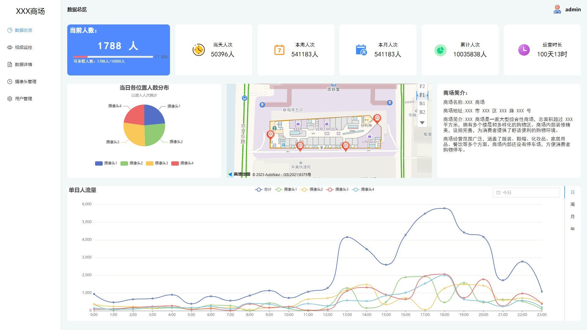
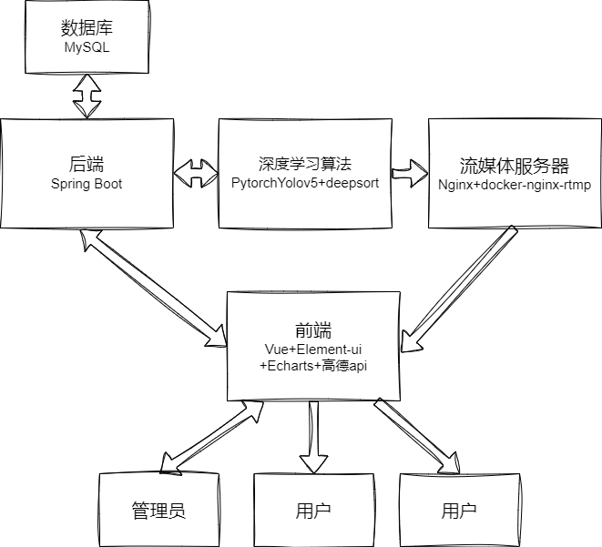
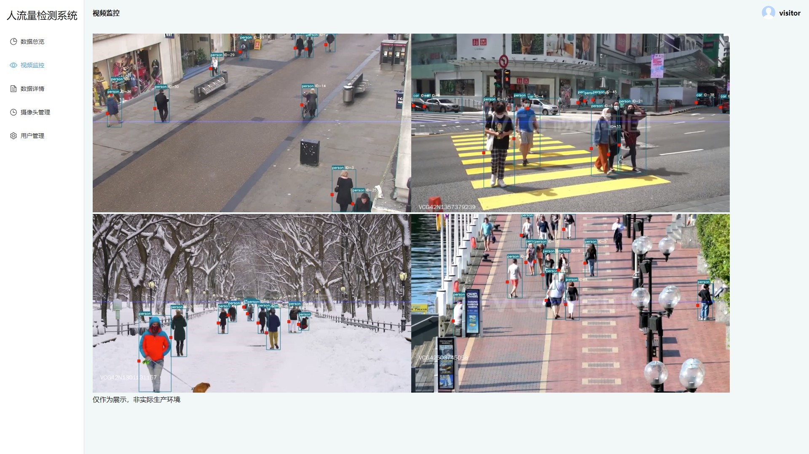
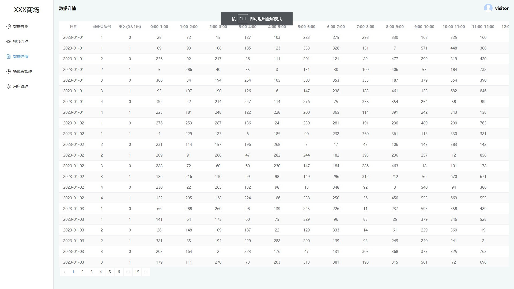
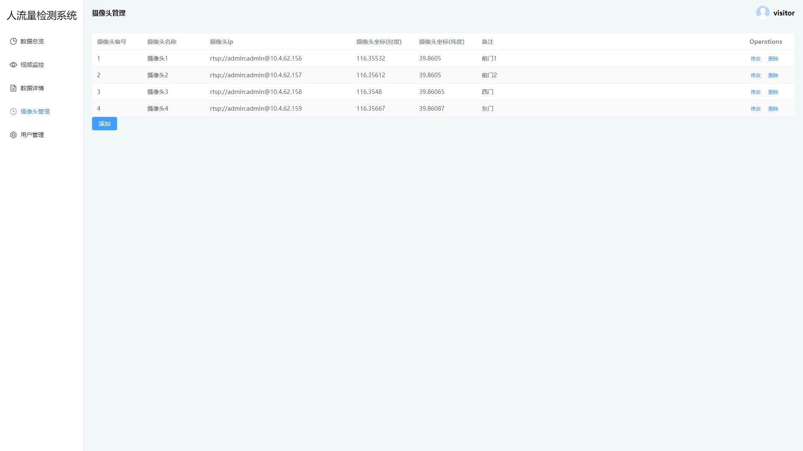

<p align="center">
	<a href="https://technitium.com/dns/">
		<br />
		<b>People Detection System</b>
	</a><br />
	<br />
	<b>人流量检测系统</b><br />
	<b>通过深度学习进行人流量检测和实时数据分析</b>
</p>
<p align="center">

</p>


## 简介
今年以来，人工智能大火，各种人工智能项目层出不穷，但是遍寻这些项目，要么依然停留在实验室刷paper阶段，要么就是接入一个简陋的前端，实现一些文字或p图之类的功能，哪怕是前段时间大火的chatgpt，也只是能够胡说八道的拼凑些文字罢了，真正能够大规模应用到生产实践的项目少之又少。
于是经过一段时间的构思和十来天的制作时间后就有了现在这个项目。，迫于能力所限、学业繁忙，未能完全达到最初想要的效果，一些功能也暂未实现。但至少能看出是个比较完整的项目。真正实现了将人工智能技术接入现有的社会生活实践，已达到提高生产效率的目的。
以上仅为个人拙见，若有不当之处还请谅解。项目也仅为练手之作，疏漏颇多，后续若有闲暇，还会完善。


## 技术栈
- **前端：** vue3 + element-ui + Echarts + 高德地图api
- **后端：** spring boot + mysql
- **人工智能：** pytorch + yolov5 + deepsort
- **部署：** docker + nginx
## 效果演示
[查看demo请戳这里](https://people.xiwang.online)
ps:服务器带宽有限，访问人多的话会很卡。

## 功能特色
- 可动态的添加删除摄像头，扩展性好;
- 可直接接入现有摄像头，无需单独安装;
- 可以以日、周、月、年为单位进行人流量分析;
- 可对用户进行权限管理，不同用户拥有不同的权限;


## 项目运行
#### 数据库
1. 创建mysql数据库
2. 根据mysql文件夹下的sql文件初始化数据

#### 后端
1. 进入Spring boot文件夹
2. 修改application.yml，配置数据源和端口
3. 运行入口文件：```PeopleDetectionSystemSpringBootApplication.class```

####  前端
1. 拉取项目文件，进入Vue文件夹
2. 注册[高德开放平台](https://lbs.amap.com/)账号，申请key，填入项目index.html的16和19行。
3. 修改vite.config.js文件的target为后端地址
4. 修改video.vue中的流媒体服务器地址。
5. 在项目目录运行命令下载并安装包文件：```cnpm install```
6. 运行：```npm run dev```

#### 流媒体服务器
本项目采用nginx搭建流媒体服务器，安装nginx的同时需要安装nginx-rtmp-module插件，建议使用 [docker-nginx-rtmp](https://github.com/alfg/docker-nginx-rtmp)，环境都集成好了，直接用就可以了。

#### 深度学习算法
1. 安装[ffmpeg](https://ffmpeg.org/)
2. 运行环境：
    - python 3.6+，pip 20+
    - pytorch
    - pip install -r requirements.txt
3. 修改main.py中的数据上传地址和流媒体服务器地址
4. 配置好环境后直接运行main.py：```python main.py```

## 整体架构
<p align="center">

</p>

## 项目截图
<p align="center">

</p>
<p align="center">

</p>
<p align="center">

</p>
<p align="center">

</p>
